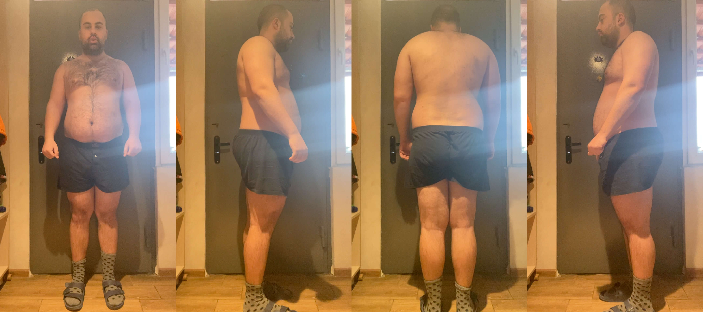

# Tasks for the day

- [x] Taking pictures in the morning at 08:30 AM
- [x] Measuring my body at 08:50 AM
- [ ] Taking pictures of food I eat at 12:00 PM
- [ ] Drinking at least 2 liters

## Day #1

### Sleep

**Slept :** 6:30 Hours

### Mass

**Weight :** 120.5KG (265.5 Pounds)

### Pictures 08:30 AM

### Body Measurements 08:50 AM

**Neck:** 45 CM

**Chest:** 119 CM

**Waist:** 104 CM

**High Hip:** 124 CM

**Hips:** 125 CM

**Thigh:** 75 CM

### Food at 12:00 PM

**Average price in Georgia :** 40 GEL (12.5$)

### Work

**Worked :** 8 Hours

### Moods

**12:00 PM ->** Feeling good

**18:00 PM ->** Feeling good

**22:00 PM ->** Feeling good
