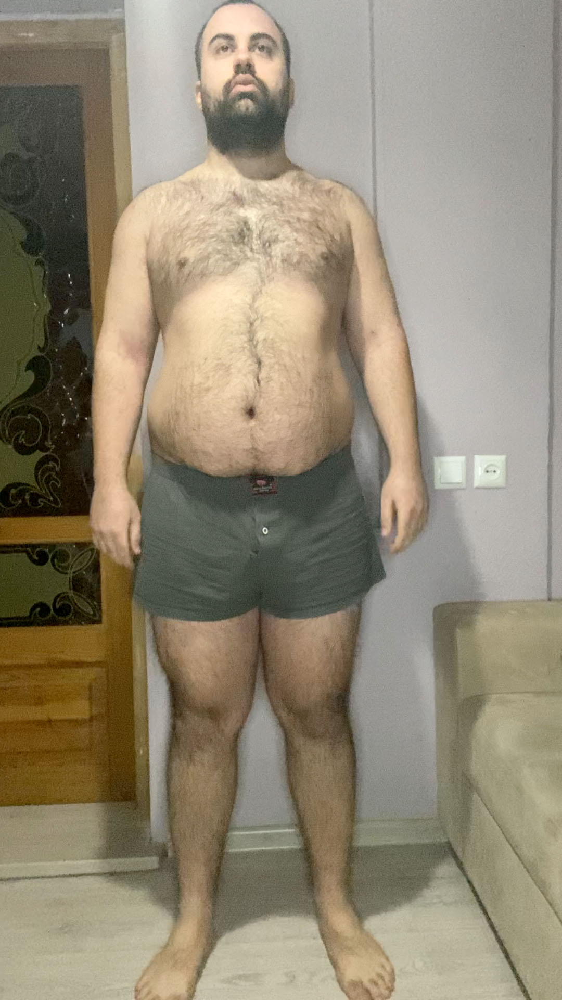
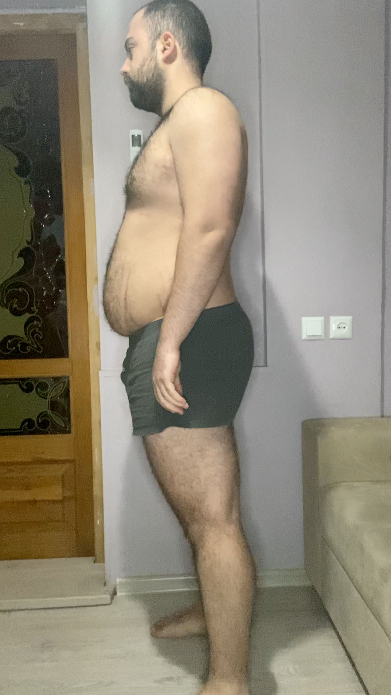
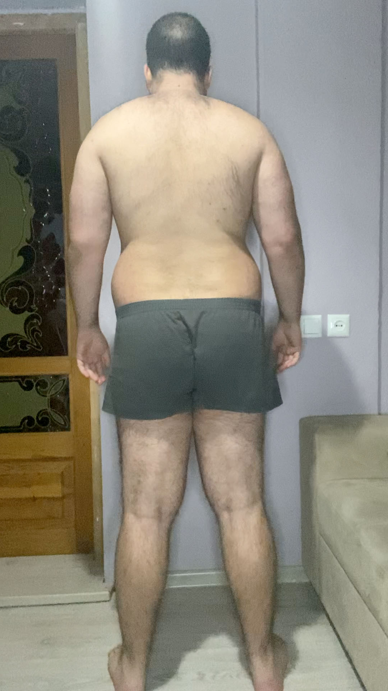
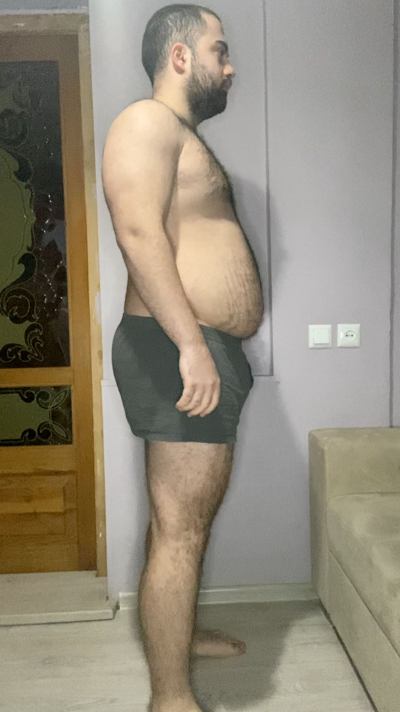
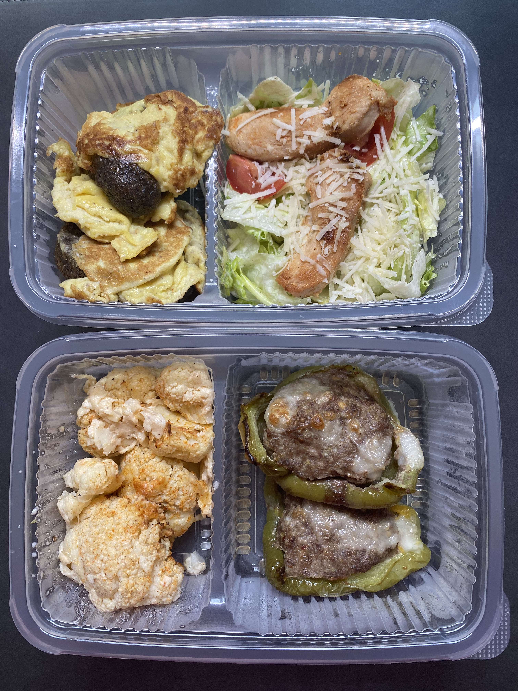

Go to [Day 9](https://groot.ge/day9)

# Tasks for the day

- [x] Taking pictures in the morning
- [x] Measuring my body when I wake up
- [ ] Workout
- [ ] Taking pictures of food I eat at 12:00 PM
- [x] Drinking at least 2 liters

## Day #10

### Sleep

**Slept :** 7:00 Hours

### Mass

**Weight :** 115.0KG (253.5 Pounds)

### Pictures

### Body Measurements

**Neck:** 41.8 CM

**Chest:** 110 CM

**Waist:** 99 CM

**High Hip:** 116 CM

**Hips:** 119 CM

**Thigh:** 72 CM

### Workout

**Walk:** Raining

### Food at 12:00 PM

- 150g peanuts

**Average price in Georgia :** 40 GEL (12.5$)

### Drinks

**Water #1 :** 07:20 600 ML

**Water #2 :** 13:30 600 ML

**Water #3 :** 15:30 300 ML

**redbull :** 17:30 250 ML

**Water #4 :** 22:30 600 ML

### Moods

**12:00 PM ->** Feeling Good

**18:00 PM ->** Feeling Good

**22:00 PM ->** Feeling Good

Go to [Day 11](https://groot.ge/day11)


