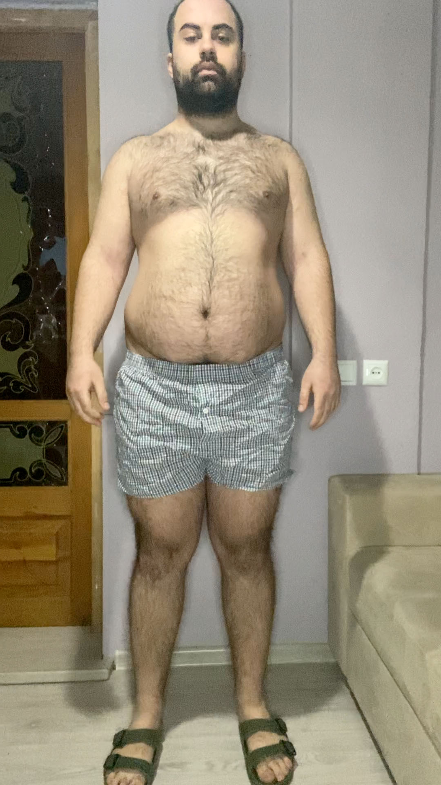
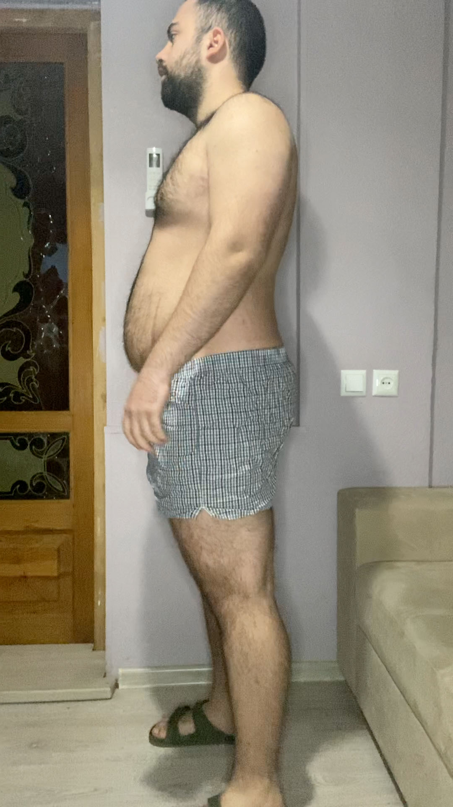
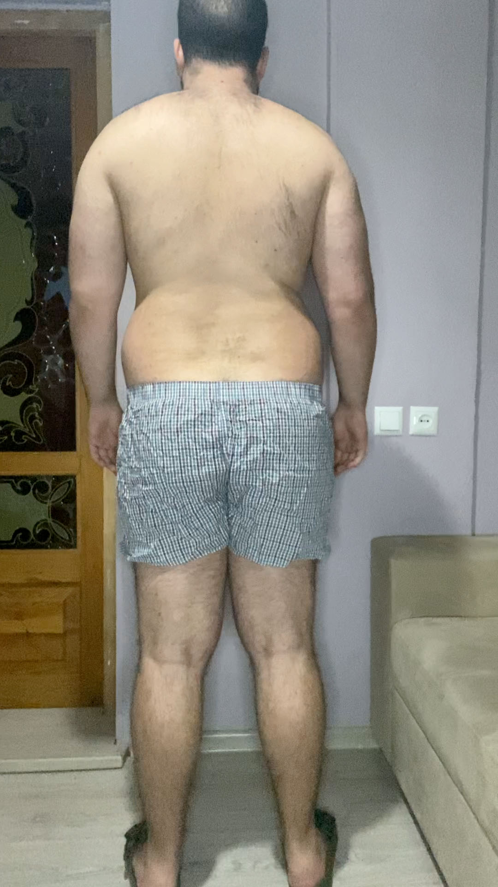
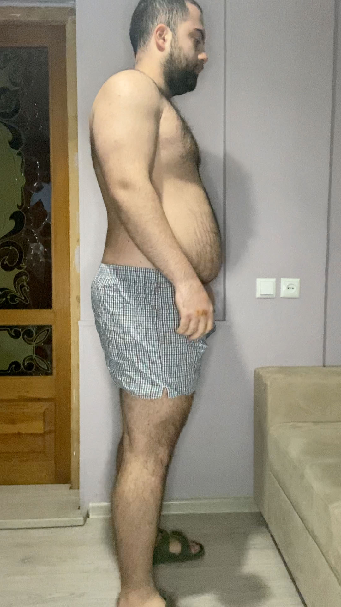
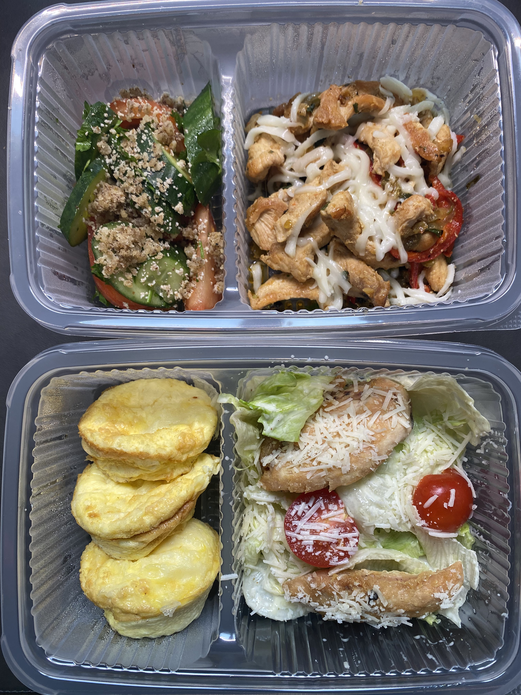

Go to [Day 11](https://groot.ge/day11)

# Tasks for the day

- [x] Taking pictures in the morning
- [x] Measuring my body when I wake up
- [ ] Workout
- [x] Taking pictures of food I eat at 12:00 PM
- [x] Drinking at least 2 liters

## Day #12

### Sleep

**Slept :** 06:30 Hours

### Mass

**Weight :** 115.2KG (253.97 Pounds)

### Pictures

### Body Measurements

**Neck:** 41.5 CM

**Chest:** 109 CM

**Waist:** 100 CM

**High Hip:** 118 CM

**Hips:** 120 CM

**Thigh:** 71.5 CM

### Workout

**Walk:** Raining

### Food at 12:00 PM

**Average price in Georgia :** 40 GEL (12.5$)

### Drinks

**Water #1 :** 08:10 300 ML

**Water #2 :** 10:00 300 ML

**Water #3 :** 16:00 300 ML

**Water #4 :** 16:35 300 ML

**Water #5 :** 18:00 300 ML

**Water #6 :** 22:00 600 ML

### Moods

**12:00 PM ->** Feeling good

**18:00 PM ->** Feeling good

**22:00 PM ->** Feeling good

Go to [Day 13](https://groot.ge/day13)


