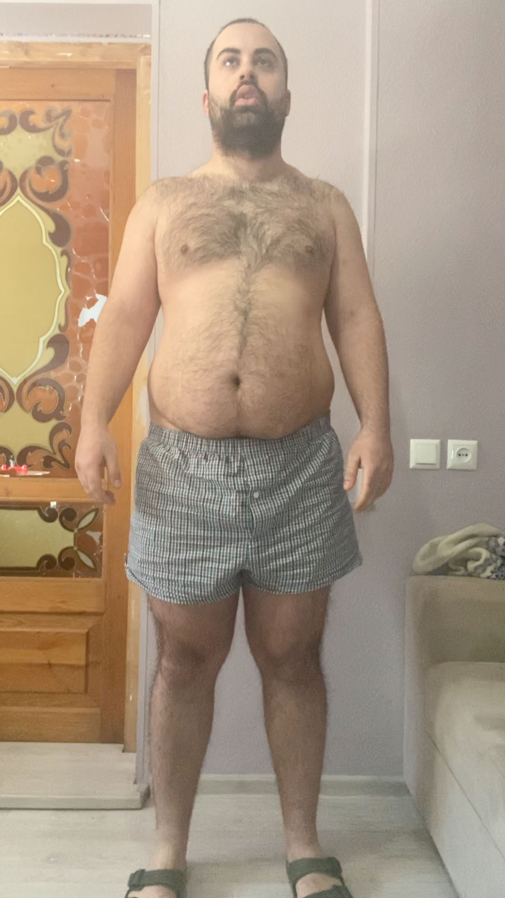
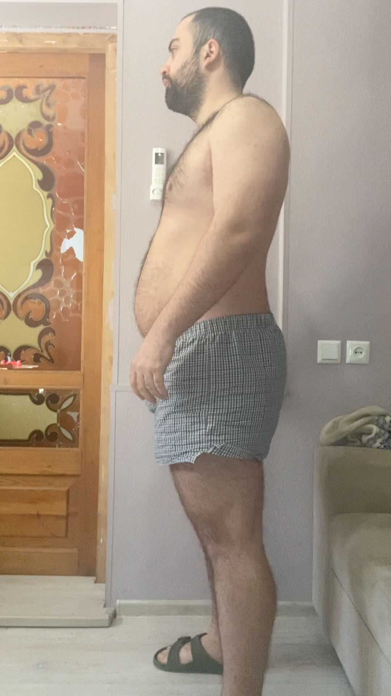
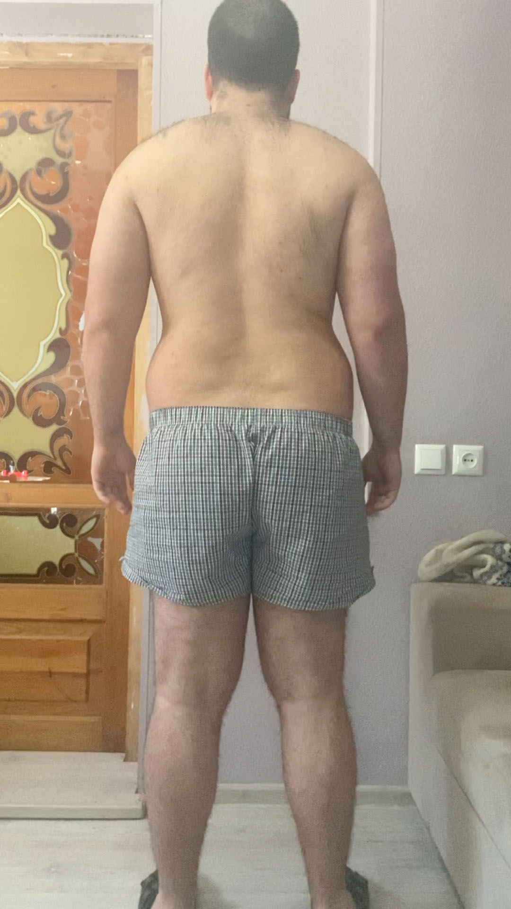
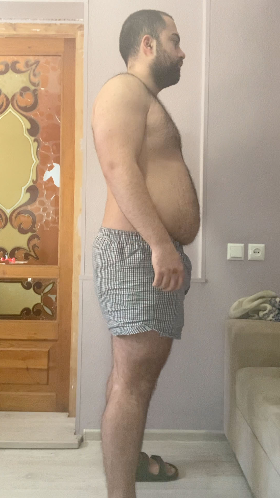
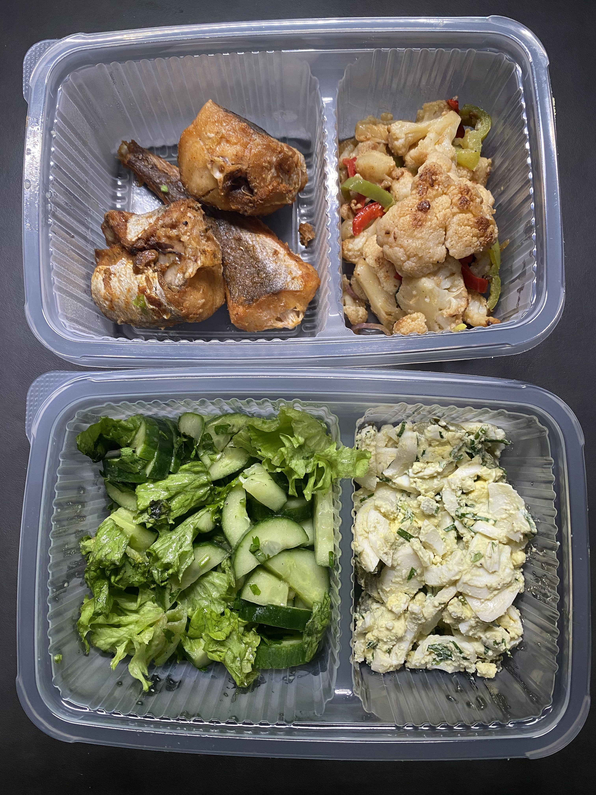

Go to [Day 12](https://groot.ge/day12)

# Tasks for the day

- [x] Taking pictures in the morning
- [x] Measuring my body when I wake up
- [ ] Workout
- [x] Taking pictures of food I eat at 12:00 PM
- [ ] Drinking at least 2 liters

## Day #13

### Sleep

**Slept :** 11:30 Hours

### Mass

**Weight :** 114.4KG (252.2 Pounds)

### Pictures

### Body Measurements

**Neck:** 41.5 CM

**Chest:** 109 CM

**Waist:** 99 CM

**High Hip:** 117 CM

**Hips:** 119 CM

**Thigh:** 71 CM

### Workout

**Walk:** Raining

### Food at 12:00 PM

Only ate half of top side dishes and added 100G peanuts

**Average price in Georgia :** 40 GEL (12.5$)

### Drinks

**Water #1 :** 13:00 600 ML

### Moods

**12:00 PM ->** Feeling good

**18:00 PM ->**

**22:00 PM ->**


