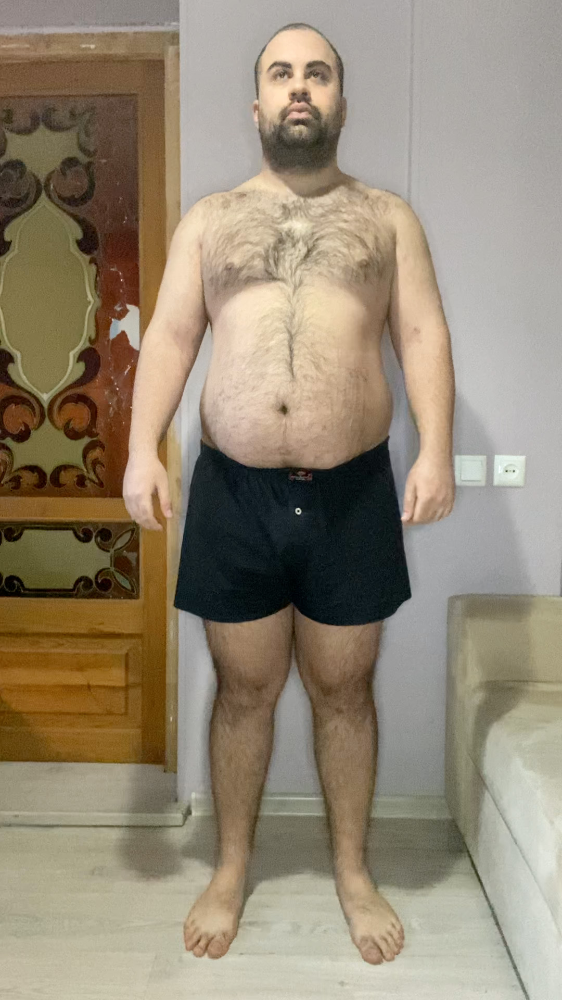
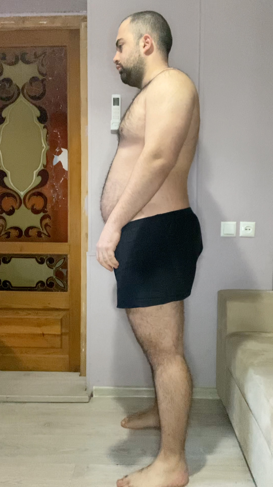
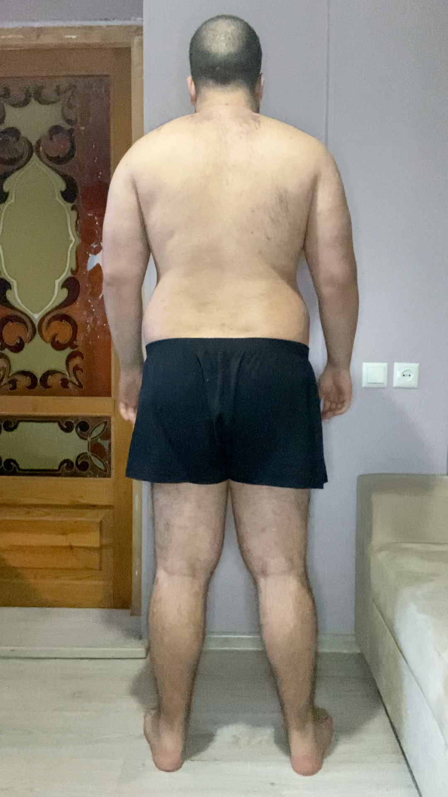
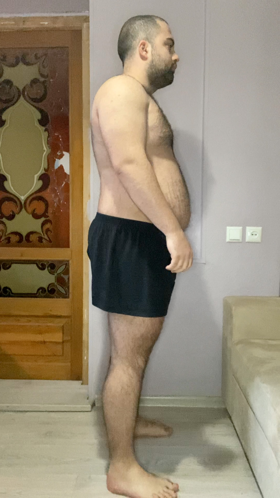
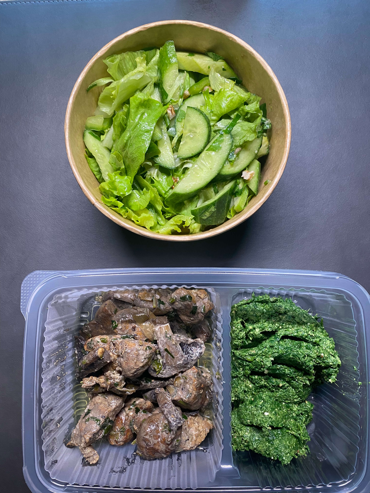

# Tasks for the day

- [x] Taking pictures in the morning at 07:45 AM
- [x] Measuring my body at 07:50 AM
- [ ] Taking pictures of food I eat at 12:00 PM
- [ ] Drinking at least 2 liters

## Day #1

### Sleep

**Slept :** 6:00 Hours

### Mass

**Weight :** 120.0KG (264.55 Pounds)

### Pictures

### Body Measurements

**Neck:** 45 CM

**Chest:** 119 CM

**Waist:** 104 CM

**High Hip:** 122.5 CM

**Hips:** 123.5 CM

**Thigh:** 75 CM

### Food at 12:00 PM

<!--  -->

<!-- **Average price in Georgia :** 40 GEL (12.5$) -->

### Drinks

**Water #1 :** 07:55 600 ML

**Water #2 :** ...

**Water #3 :** ...

**Water #3 :** ...

### Work

**Worked :** 0 Hours

### Moods

**12:00 PM ->** ...

**18:00 PM ->** ...

**22:00 PM ->** ...
