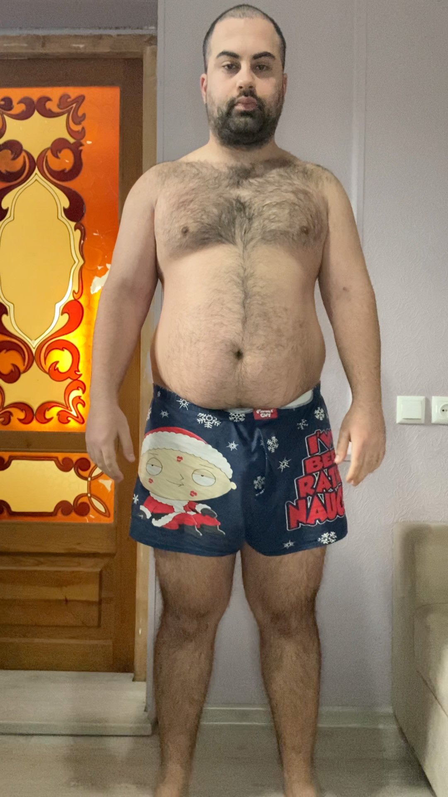
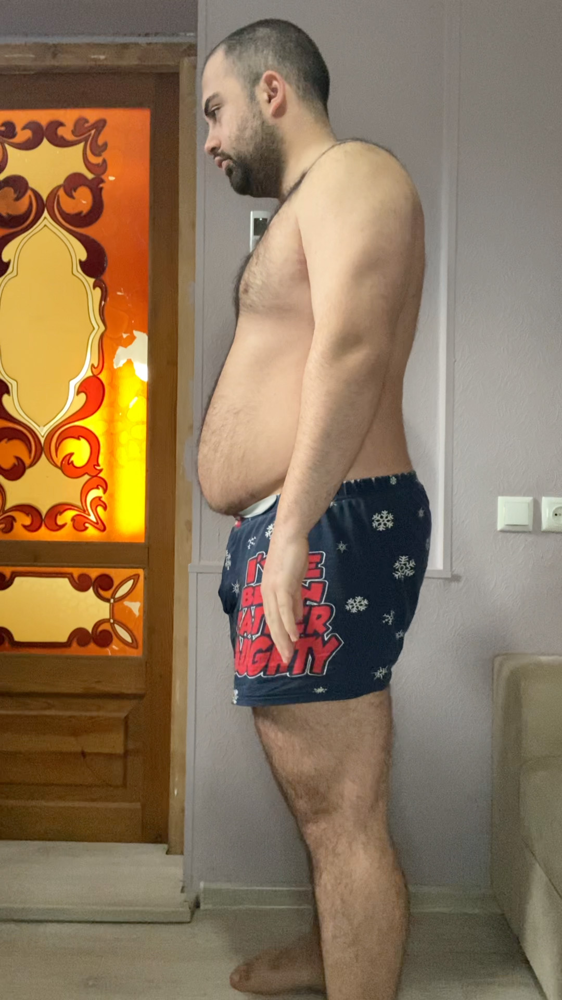
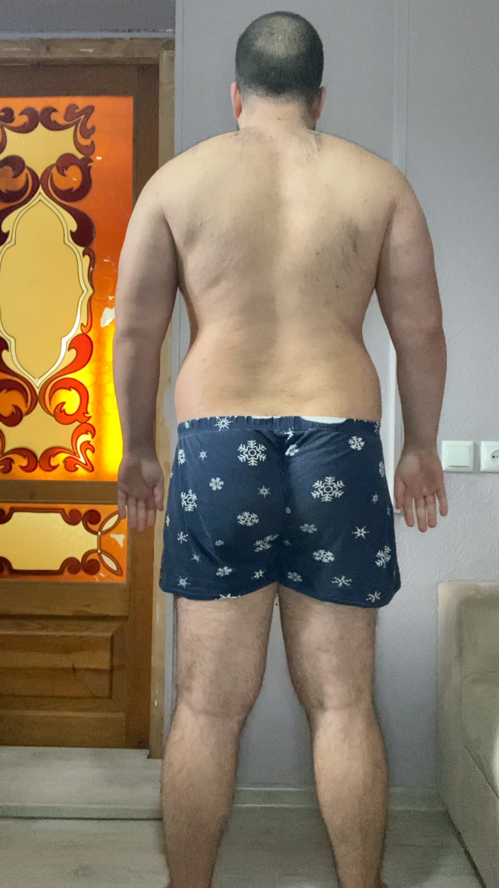
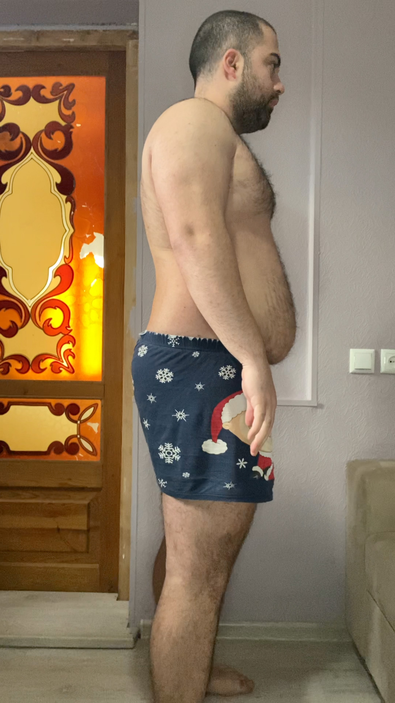

# Tasks for the day

- [x] Taking pictures in the morning at 07:45 AM
- [x] Measuring my body at 07:50 AM
- [x] ### Workout at 08:10 AM
- [x] Taking pictures of food I eat at 12:00 PM
- [ ] Drinking at least 2 liters

## Day #3

### Sleep

**Slept :** 7:00 Hours

### Mass

**Weight :** 118.1KG (266.3 Pounds)

### Pictures

### Body Measurements

**Neck:** 44.5 CM

**Chest:** 117.5 CM

**Waist:** 103 CM

**High Hip:** 123 CM

**Hips:** 123 CM

**Thigh:** 74.5 CM

### Workout

**Walk:** 3.17KM (1.97 Miles)

### Food at 12:00 PM

**Average price in Georgia :** 40 GEL (12.5$)

### Drinks

**Water #1 :** 08:30 600 ML

**Water #2 :** 10:10 300 ML

**Mineral water #1 :** 10:10 300 ML

### Work

**Worked :** 0 Hours

### Moods

**12:00 PM ->** ...

**18:00 PM ->** ...

**22:00 PM ->** ...
