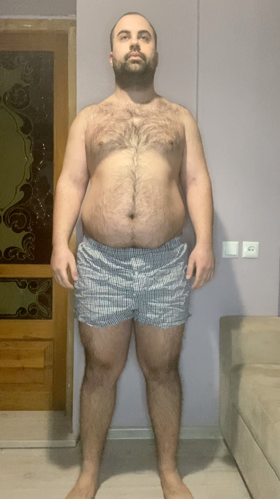
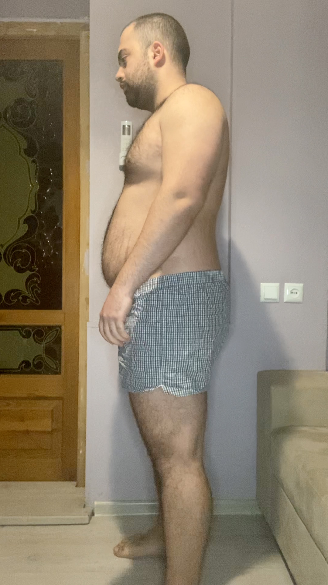
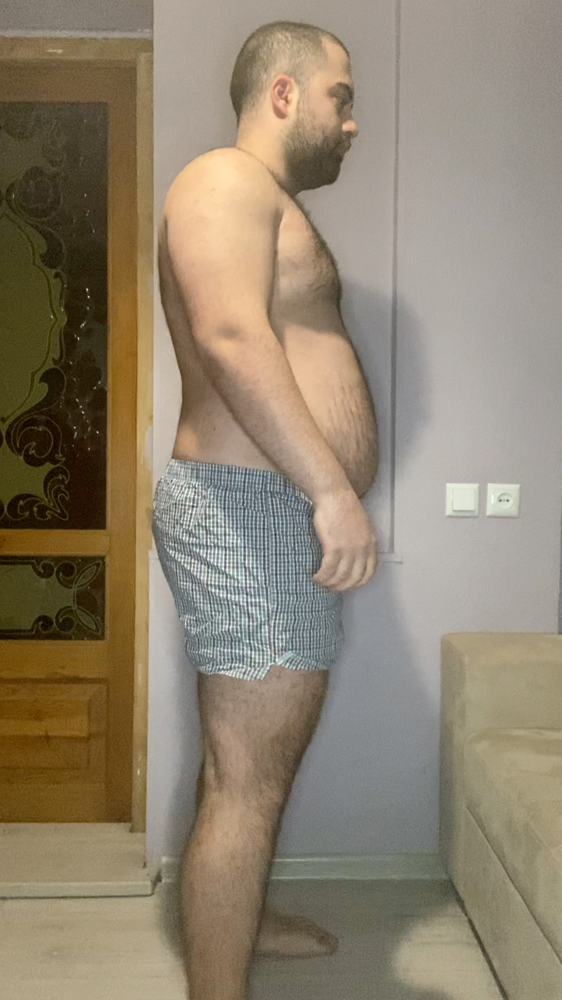

Go to [Day 3](https://groot.ge/day3)

# Tasks for the day

- [x] Taking pictures in the morning
- [x] Measuring my body when I wake up
- [x] Workout
- [x] Taking pictures of food I eat at 12:00 PM
- [x] Drinking at least 2 liters

## Day #4

### Sleep

**Slept :** 5:00 Hours

**Slept :** 2:00 Hours

### Mass

**Weight :** 118.4KG (261 Pounds)

### Pictures

### Body Measurements

**Neck:** 44 CM

**Chest:** 116 CM

**Waist:** 102 CM

**High Hip:** 120.5 CM

**Hips:** 122 CM

**Thigh:** 73 CM

### Workout

**Walk:** 3.17 KM (1.97 miles)

### Food at 12:00 PM

**Average price in Georgia :** 40 GEL (12.5$)

### Drinks

**Water #1 :** 05:30 300 ML

**Water #2 :** 06:30 300 ML

**Water #3 :** 09:10 600 ML

**Red bull without sugar #1 :** 12:40 250ML

**Water #4 :** 12:50 300 ML

**Water #4 :** 21:00 600ML

**Water #4 :** 23:00 300ML

### Work

**Worked :** 10 Hours

### Moods

**12:00 PM ->** Feeling good

**18:00 PM ->** Feeling good

**22:00 PM ->** Stomach is little upset

Go to [Day 5](https://groot.ge/day5)


