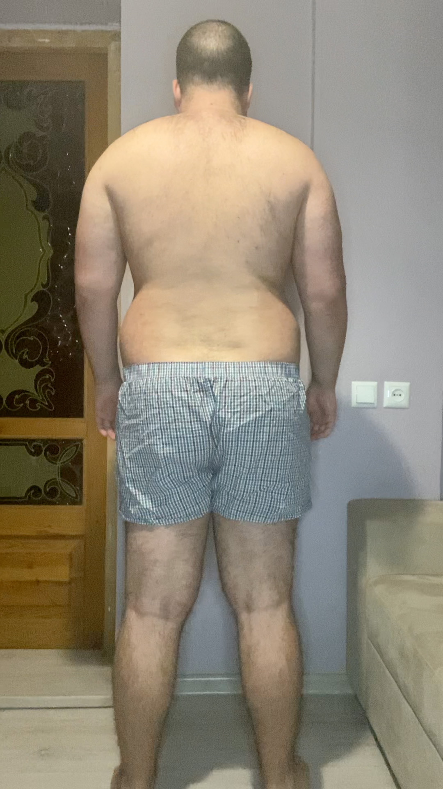

# Tasks for the day

- [x] Taking pictures in the morning at 07:45 AM
- [x] Measuring my body at 07:50 AM
- [ ] ### Workout at 08:10 AM
- [ ] Taking pictures of food I eat at 12:00 PM
- [ ] Drinking at least 2 liters

## Day #4

### Sleep

**Slept :** 5:00 Hours

### Mass

**Weight :** 118.4KG (261 Pounds)

### Pictures

### Body Measurements

**Neck:** 44 CM

**Chest:** 116 CM

**Waist:** 102 CM

**High Hip:** 120.5 CM

**Hips:** 122 CM

**Thigh:** 73 CM

### Workout

**Walk:** ...

### Food at 12:00 PM

<!--  -->

<!-- **Average price in Georgia :** 40 GEL (12.5$) -->

### Drinks

**Water #1 :** 05:30 300 ML

**Water #2 :** 06:30 300 ML

### Work

**Worked :** 0 Hours

### Moods

**12:00 PM ->** ...

**18:00 PM ->** ...

**22:00 PM ->** ...
