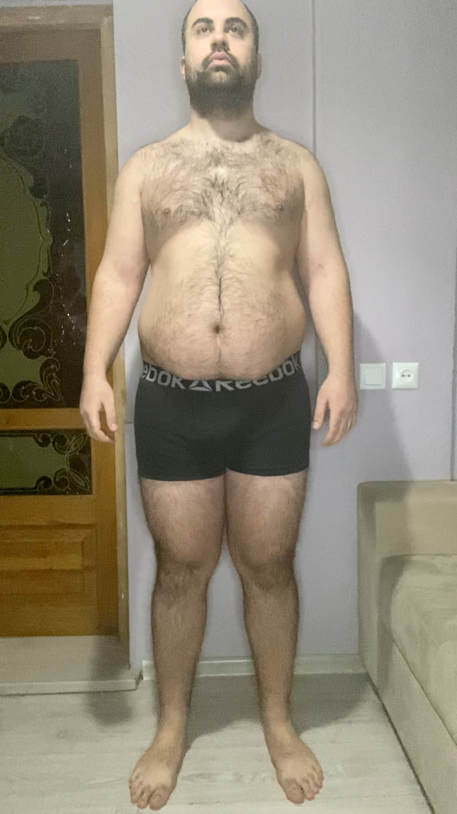
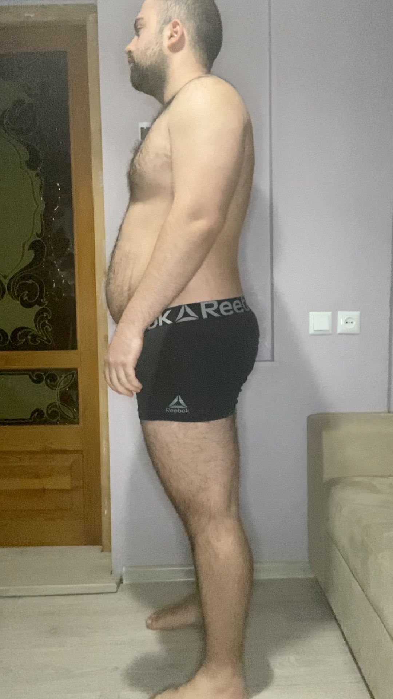
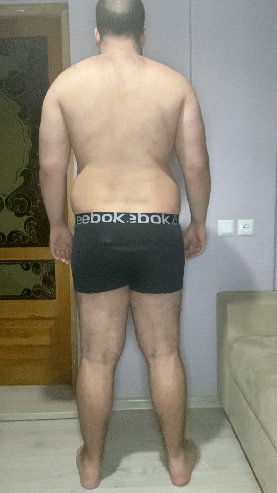
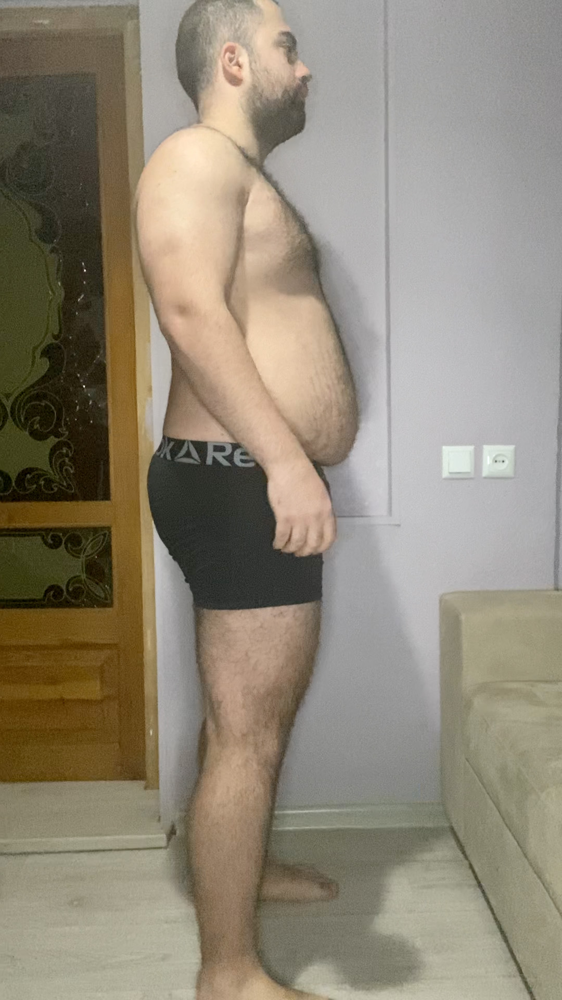

# Tasks for the day

- [x] Taking pictures in the morning
- [x] Measuring my body when I wake up
- [ ] Workout
- [ ] Taking pictures of food I eat at 12:00 PM
- [ ] Drinking at least 2 liters

## Day #5

### Sleep

**Slept :** 6:00 Hours

### Mass

**Weight :** 116.6KG (257 Pounds)

### Pictures

### Body Measurements

**Neck:** 43.5 CM

**Chest:** 114.5 CM

**Waist:** 102 CM

**High Hip:** 119 CM

**Hips:** 121 CM

**Thigh:** 71.5 CM

### Workout

**Walk:** 3.17 KM (1.97 miles)

### Food at 12:00 PM

<!--  -->

<!-- **Average price in Georgia :** 40 GEL (12.5$) -->

### Drinks

**Water #1 :** 05:50 600 ML

### Work

**Worked :** 0 Hours

### Moods

**12:00 PM ->** ...

**18:00 PM ->** ...

**22:00 PM ->** ...
