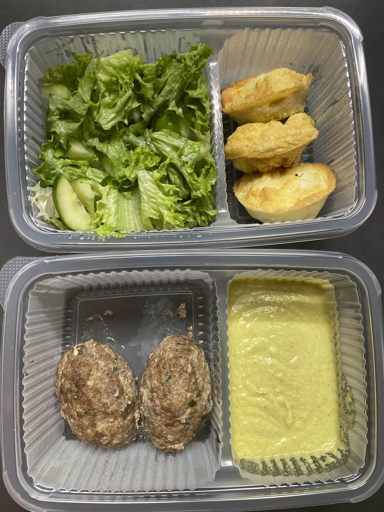

Go to [Day 6](https://groot.ge/day6)

# Tasks for the day

- [x] Taking pictures in the morning
- [x] Measuring my body when I wake up
- [ ] Workout
- [x] Taking pictures of food I eat at 12:00 PM
- [x] Drinking at least 2 liters

## Day #7

### Sleep

**Slept :** 3:00 Hours

### Mass

**Weight :** 116.6KG (257 Pounds)

### Pictures

### Body Measurements

**Neck:** 42 CM

**Chest:** 113 CM

**Waist:** 99.5 CM

**High Hip:** 117.5 CM

**Hips:** 121 CM

**Thigh:** 72 CM

### Workout

**Walk:** Raining

### Food at 12:00 PM

**Average price in Georgia :** 40 GEL (12.5$)

### Drinks

**Water #1 :** 09:30 600 ML

**Water #2 :** 11:50 600 ML

**Water #3 :** 17:50 300 ML

**Water #4 :** 18:20 300 ML

**Water #4 :** 21:00 600 ML

### Moods

**12:00 PM ->** Feeling good

**18:00 PM ->** Feeling good

**22:00 PM ->** Feeling good
