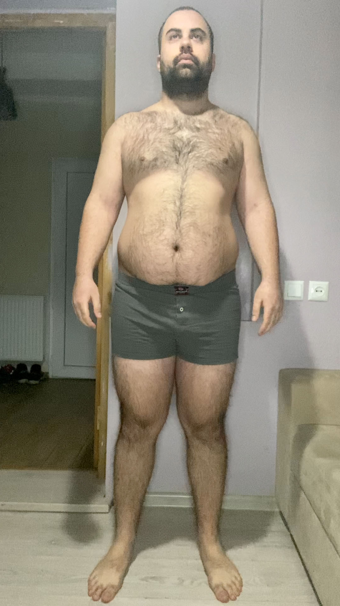
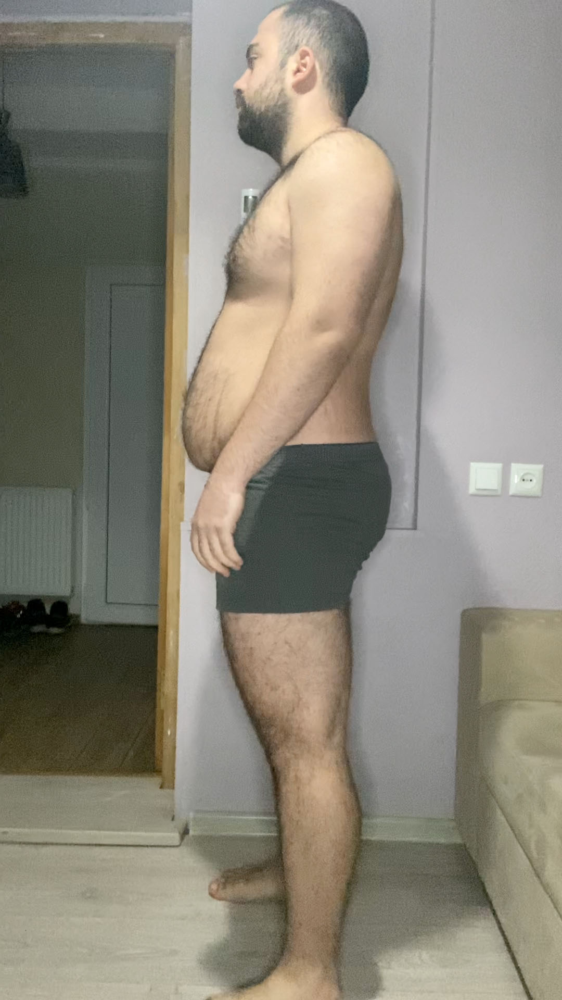
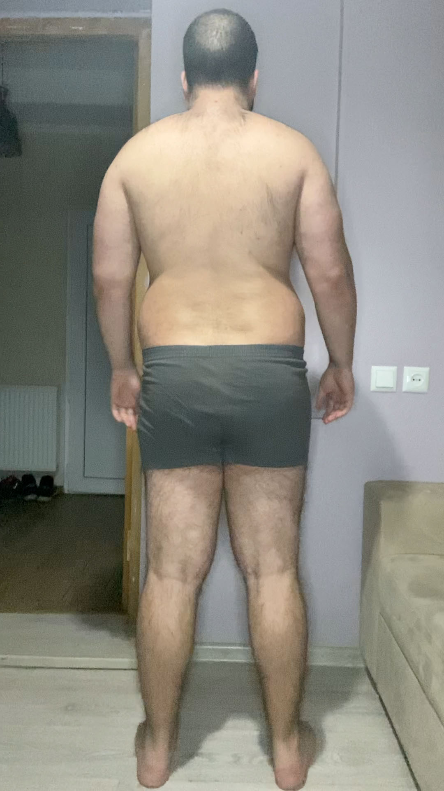
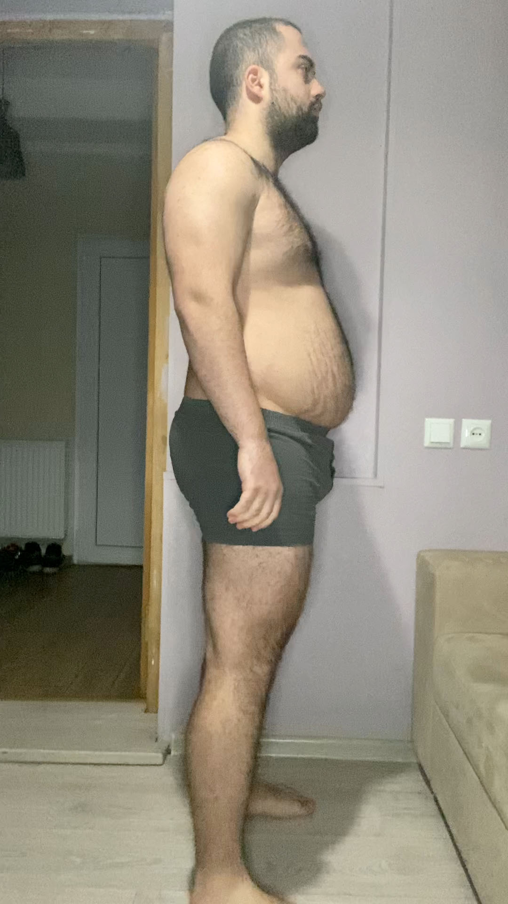
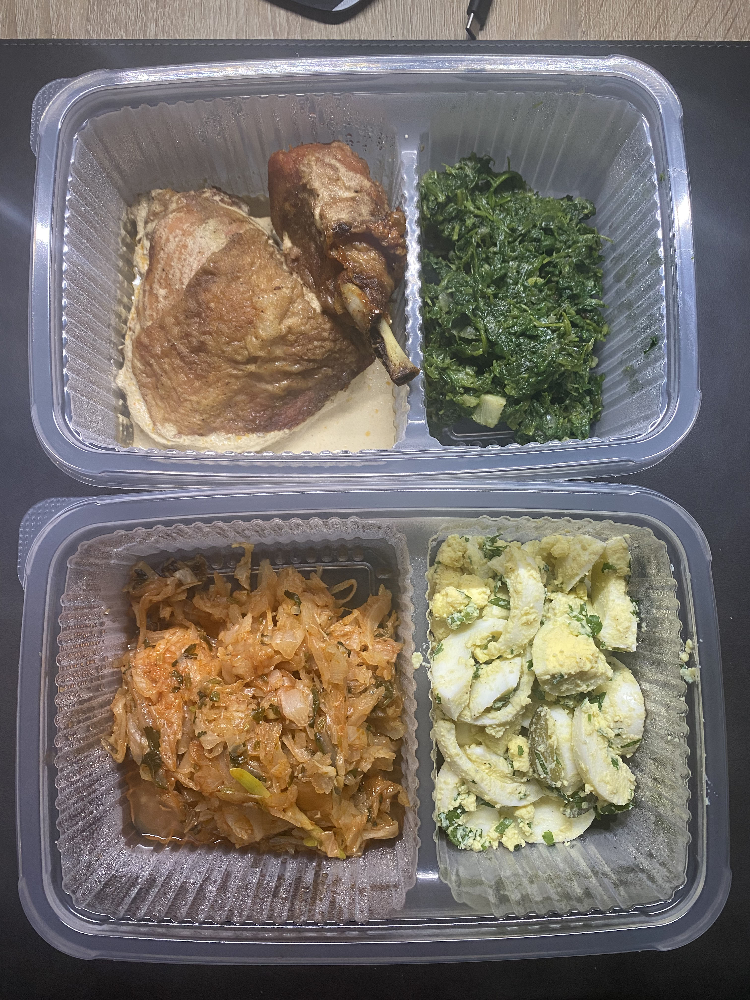

Go to [Day 7](https://groot.ge/day7)

# Tasks for the day

- [x] Taking pictures in the morning
- [x] Measuring my body when I wake up
- [ ] Workout
- [x] Taking pictures of food I eat at 12:00 PM
- [ ] Drinking at least 2 liters

## Day #8

### Sleep

**Slept :** 8:00 Hours

### Mass

**Weight :** 115.8KG (255.3 Pounds)

### Pictures

### Body Measurements

**Neck:** 41.5 CM

**Chest:** 112 CM

**Waist:** 99 CM

**High Hip:** 118 CM

**Hips:** 119.5 CM

**Thigh:** 72 CM

### Workout

**Walk:** Raining

### Food at 12:00 PM

**Average price in Georgia :** 40 GEL (12.5$)

### Drinks

**Water #1 :** 07:50 600 ML

**Water #1 :** 12:20 500 ML

### Moods

**12:00 PM ->**

**18:00 PM ->**

**22:00 PM ->**
