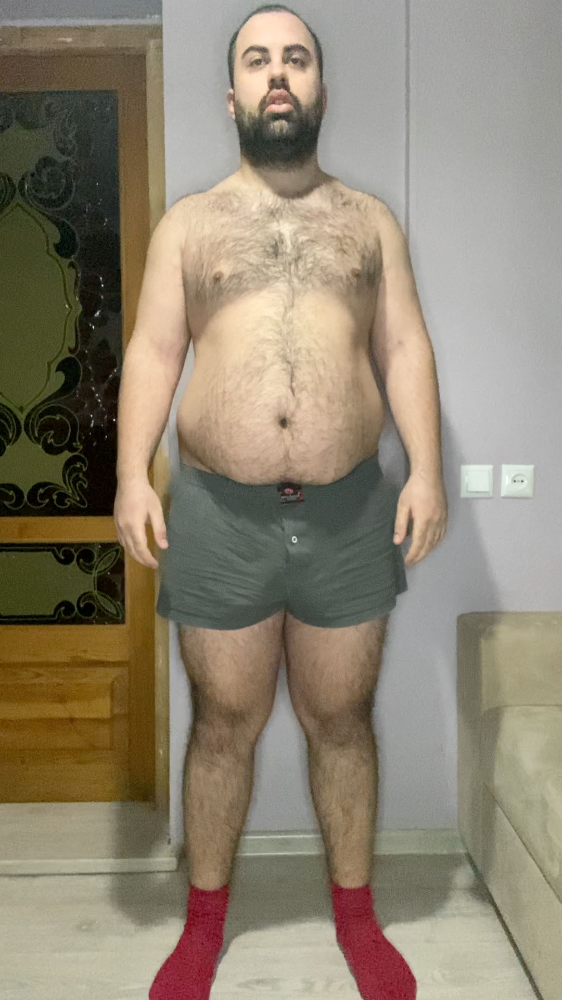
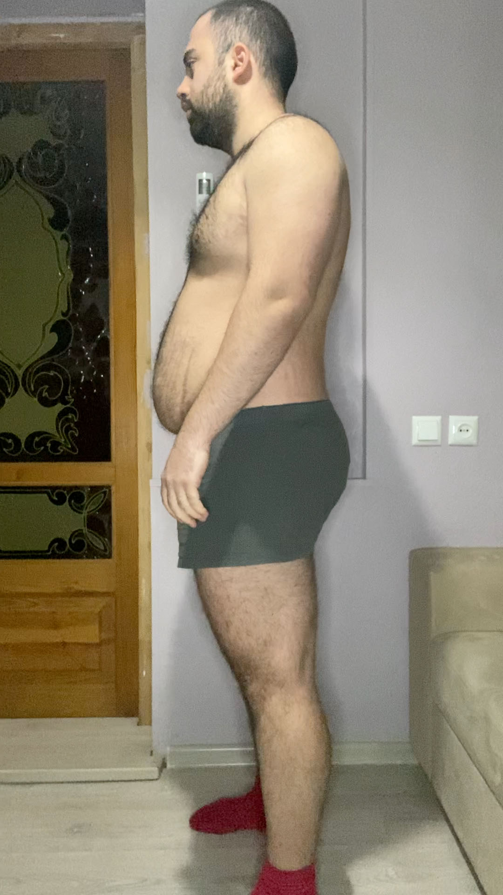
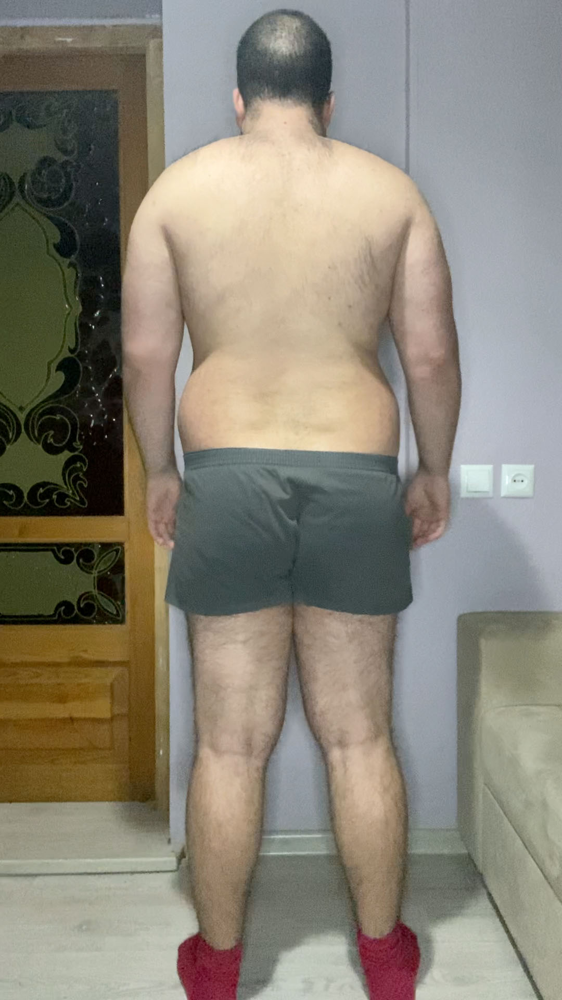
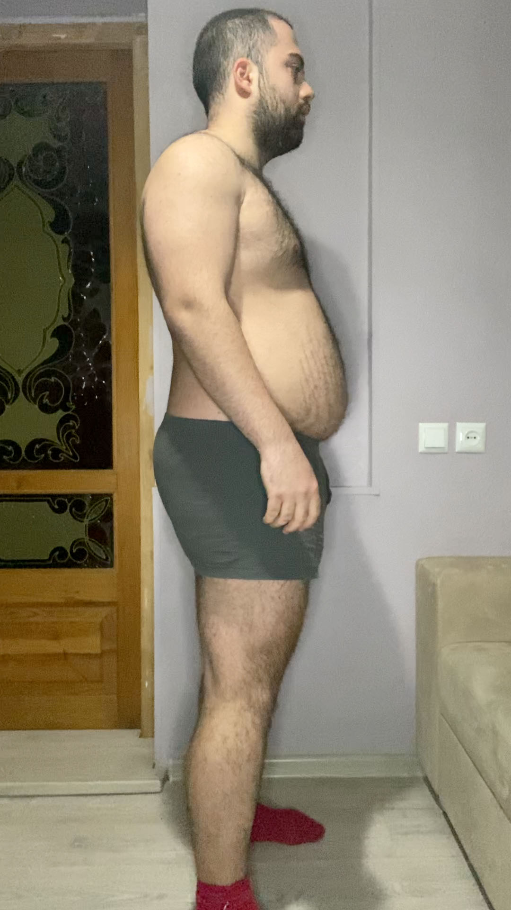
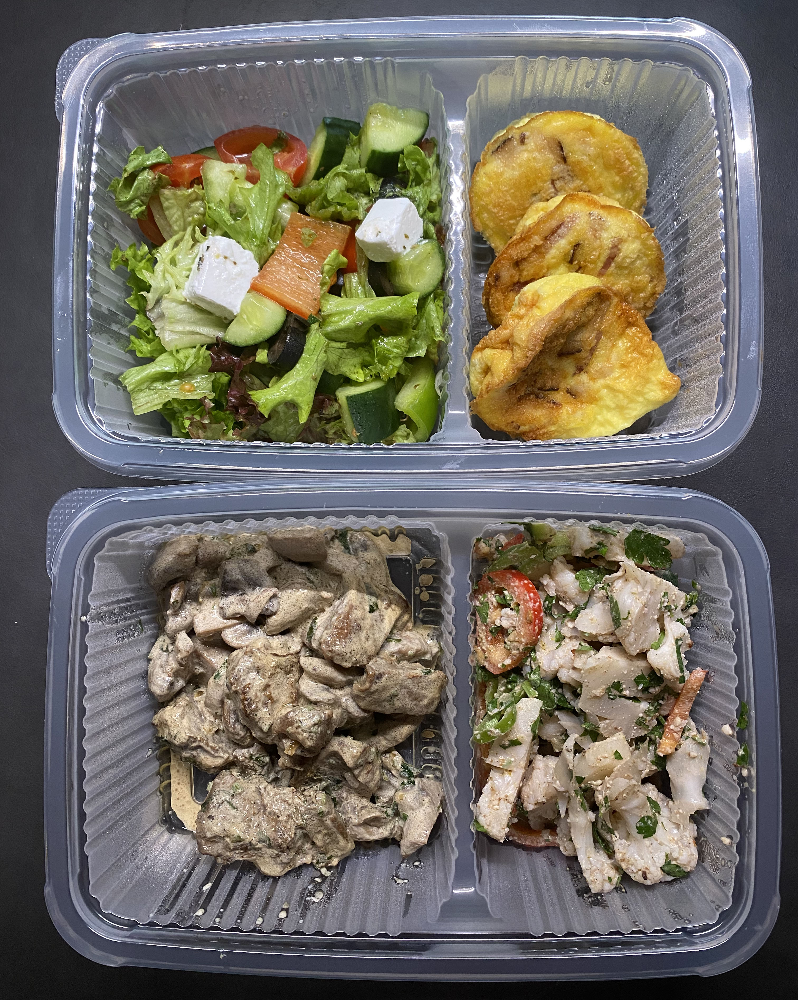

Go to [Day 8](https://groot.ge/day8)

# Tasks for the day

- [x] Taking pictures in the morning
- [x] Measuring my body when I wake up
- [ ] Workout
- [x] Taking pictures of food I eat at 12:00 PM
- [x] Drinking at least 2 liters

## Day #9

### Sleep

**Slept :** 6:00 Hours

### Mass

**Weight :** 115.8KG (255.3 Pounds)

### Pictures

### Body Measurements

**Neck:** 42.5 CM

**Chest:** 112 CM

**Waist:** 99.5 CM

**High Hip:** 117 CM

**Hips:** 119 CM

**Thigh:** 72.5 CM

### Workout

**Walk:** Raining

### Food at 12:00 PM

**Average price in Georgia :** 40 GEL (12.5$)

### Drinks

**Water #1 :** 06:00 600 ML

**Water #2 :** 12:00 600 ML

**Redbull #1 :** 12:30 250 ML

**Coca cola zero #1 :** 12:50 500 ML

**Water #3 :** 17:00 600 ML

**Water #4 :** 10:00 600 ML

### Moods

**12:00 PM ->** Feeling good

**18:00 PM ->** Feeling good

**22:00 PM ->** Feeling good

Go to [Day 10](https://groot.ge/day10)


