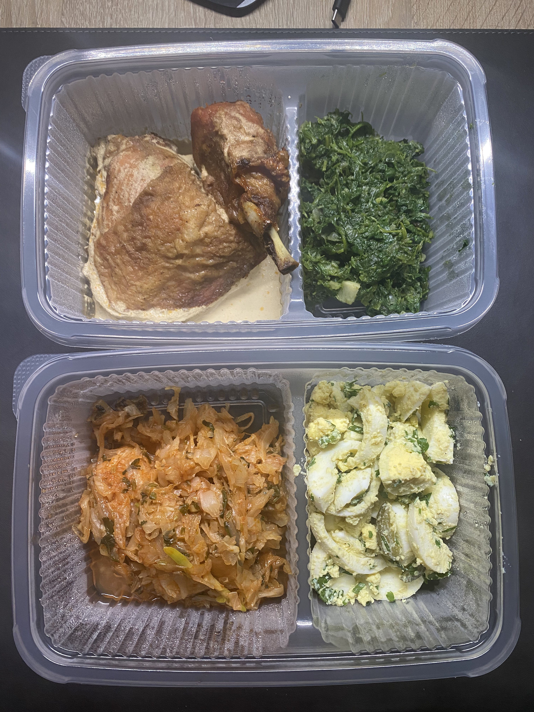

Go to [Day 8](https://groot.ge/day8)

# Tasks for the day

- [x] Taking pictures in the morning
- [x] Measuring my body when I wake up
- [ ] Workout
- [ ] Taking pictures of food I eat at 12:00 PM
- [ ] Drinking at least 2 liters

## Day #9

### Sleep

**Slept :** 6:00 Hours

### Mass

**Weight :** 115.8KG (255.3 Pounds)

### Pictures

### Body Measurements

**Neck:** 42.5 CM

**Chest:** 112 CM

**Waist:** 99.5 CM

**High Hip:** 117 CM

**Hips:** 119 CM

**Thigh:** 72.5 CM

### Workout

**Walk:** Raining

### Food at 12:00 PM

<!-- 

**Average price in Georgia :** 40 GEL (12.5$) -->

### Drinks

**Water #1 :** 06:00 600 ML

### Moods

**12:00 PM ->**

**18:00 PM ->**

**22:00 PM ->**
